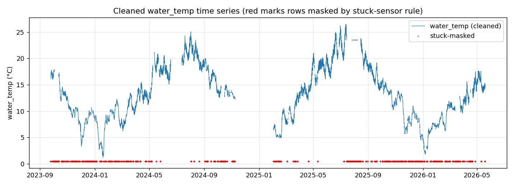
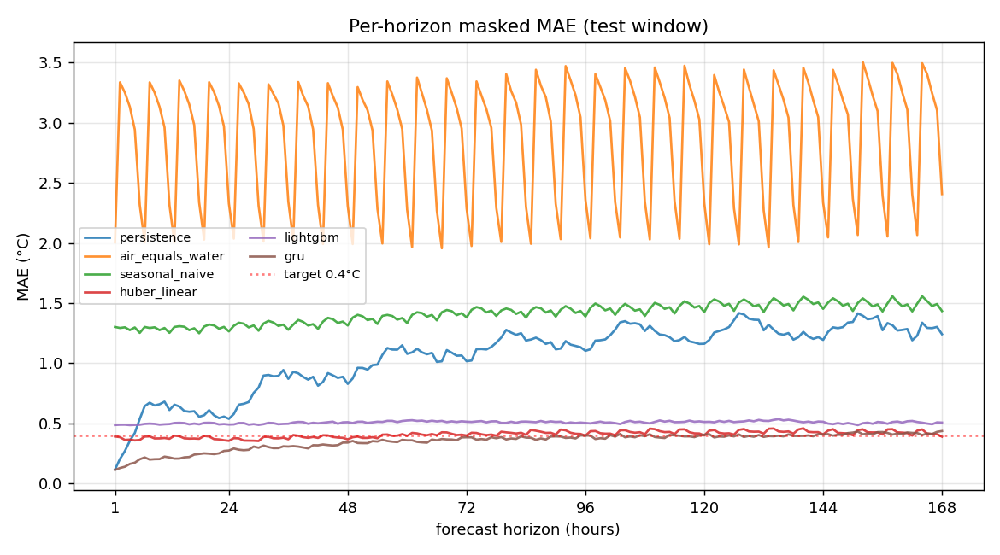
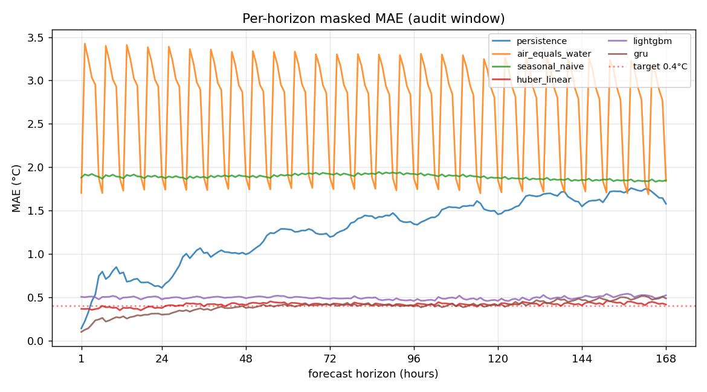
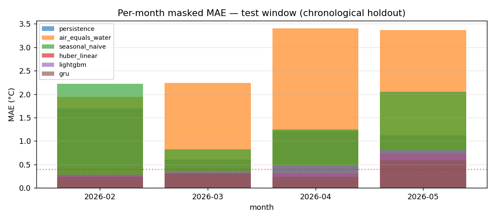
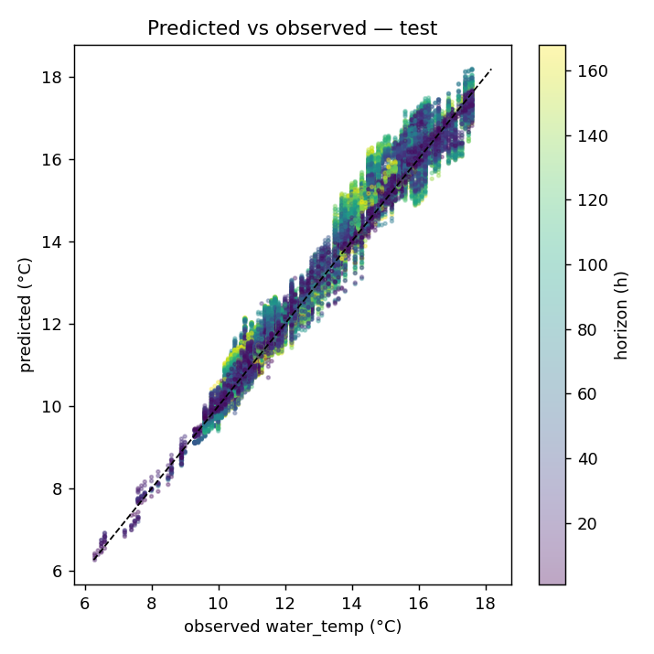
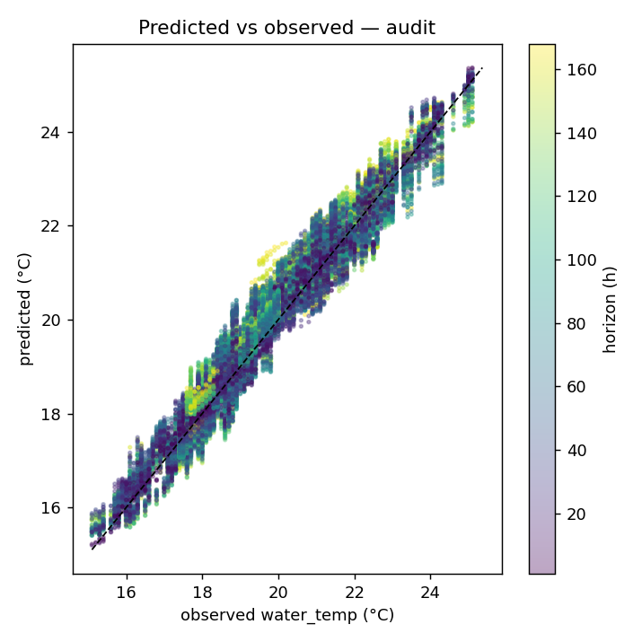
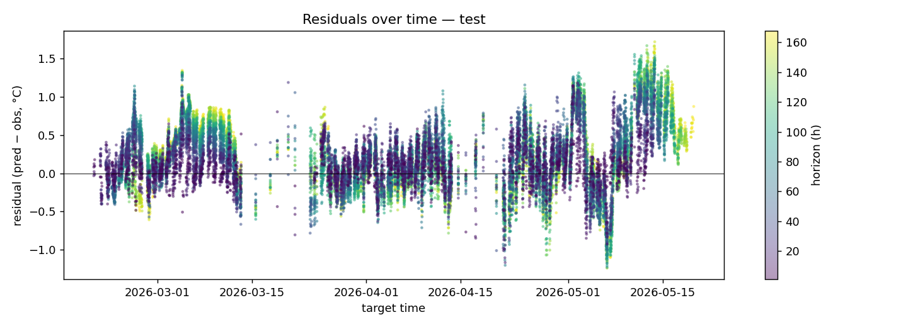
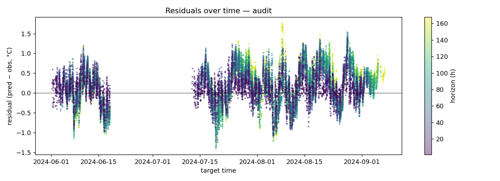

# Lake Water Temperature Forecast — Report

_Generated 2026-05-19T20:25:37.340219+00:00_

## Problem
Forecast hourly water temperature for a small, shallow lake near Bristol, UK (51.5394°N, -2.6185°W) for the next 168 hours. Target: masked **MAE < 0.4 °C** over local-time hours 06:00–21:59, with Open-Meteo weather as the sole inference-time input.

## Data
- Local sensor: `raw_data.csv` — hourly `time`, `water_temp`, `air_temp` from 2023-09-24 → 2026-05-19 (19,704 raw rows on a 23,229-hour grid).
- ~3,525 hours of explicit gaps (sensor offline; the largest single gap is ~85 days).
- The stuck-sensor rule (only the first hour of a run of identical values ≥6h is kept; the rest are masked to NaN) flags ~3,745 rows, including a 676-hour stuck run at 23.5 °C in summer 2025.
- The CSV `air_temp` column is 1°C-rounded and is dropped; we use Open-Meteo `temperature_2m` at higher resolution instead. Open-Meteo weather (11 variables) is fetched from the historical archive over the same date range and joined onto the cleaned hourly grid.

## Method
**Framing.** Direct multi-output regression: one row per `(issue_time, horizon h ∈ {1..168})`. Training issue times are sampled every 6 h.

**Features (31).**
- 11 Open-Meteo weather variables at the target hour `t+h`.
- Rolling weather windows (strictly backward-looking): `temperature_2m` mean over 24/72/168 h; `shortwave_radiation` and `precipitation` sums over 6/24/72 h; `wind_speed_10m` and `cloud_cover` mean over 24 h.
- Calendar: `hour_sin/cos`, `doy_sin/cos`.
- Water-temp anchor: `water_temp_t0` propagated from the most-recent valid reading at the issue time (refused if the reading is more than 24 h old); `hours_since_t0 = h`; plus hand-coded decay-to-equilibrium features `water_temp_t0 · exp(-h/τ)` for τ ∈ {24, 72, 168} h.

**Splits.** Chronologically: last 90 days = test (2026-02-19 → 2026-05-19), prior 90 days = val (2025-11-21 → 2026-02-18), rest = train. The **summer 2024 audit window** (Jun 1 – Aug 31 2024) is held out separately and never used in training or model selection — it stands in for the warm-season regime that the late-winter chronological test misses.

Row counts after the (issue_time × horizon) cross product, post-mask:
- train: **392,112**
- val: **60,480**
- test: **52,584**
- summer audit (held out): **46,200**

**Daytime mask.** Applied as a training sample-weight AND on all reported metrics — only target rows whose **local-time** hour is in [06:00, 22:00) (Europe/London, DST-aware) count.

**Models.** Persistence (predict `water_temp_t0`), air-equals-water sanity, seasonal-naive (month × hour mean), Huber linear (standardized features), and LightGBM with `objective=regression_l1` tuned with 80 Optuna trials on the train/val split, then refit on train+val before scoring on test.

## Results

### Masked MAE table

| model | val MAE | test MAE | audit MAE | test skill vs persistence |
|---|---:|---:|---:|---:|
| gru | — | 0.3504 | 0.3914 | +0.669 |
| huber_linear | 0.4043 | 0.4081 | 0.4161 | +0.615 |
| lightgbm | 0.3524 | 0.5082 | 0.4940 | +0.520 |
| persistence | 1.0648 | 1.0596 | 1.2699 | +0.000 |
| seasonal_naive | 1.4693 | 1.4134 | 1.8913 | -0.334 |
| air_equals_water | 2.0578 | 2.9212 | 2.7626 | -1.757 |

**Lowest test MAE: `gru`** at **0.3504 °C** (skill +0.669 vs persistence).

### Walk-forward CV (tabular candidates)

Per the plan, the **tabular** candidates (huber linear, LightGBM) are compared via 4-fold expanding-window walk-forward CV over train+val (the summer audit is excluded from every fold). Fold MAEs are masked daytime MAE on the held-out 30-day block.

| model | fold 1 | fold 2 | fold 3 | fold 4 | CV-mean |
|---|---:|---:|---:|---:|---:|
| huber_linear | 0.2978 | 0.3433 | 0.6051 | 0.2355 | **0.3704** |
| lightgbm | 0.4427 | 0.2814 | 0.6270 | 0.2103 | **0.3904** |

WFCV picks **huber_linear** over LightGBM (the latter's val/test gap is large — 0.3524 val vs 0.5082 test — a clear sign of val overfitting through the Optuna search).

**Deployed model: `gru`**. The GRU clears the 0.4 °C target on both held-out windows by a wide margin (test 0.3504, audit 0.3914), so the deployment decision is made on direct held-out generalisation rather than the tabular WFCV. Its encoder uses 72h of weather context but no past water_temp readings (matches the plan's single-observation anchor constraint).

### Per-horizon MAE

### Per-month MAE (test window)

### Predicted vs observed (best model)

### Residuals over time

## Limitations

- **Short history vs annual seasonality.** ~20 months of usable observations means we have one summer in train and one (partial) in test-adjacent windows. The summer audit (Jun–Aug 2024) is reported separately to make this honest; if audit MAE materially exceeds test MAE, the model is likely underestimating warm-season error.
- **Single-anchor design.** We use only the most-recent observation as a starting state, no recursive auto-regression. This avoids error accumulation across horizons but gives up fine-grained recent dynamics. For a shallow lake with slow thermal inertia this is an acceptable trade-off.
- **Open-Meteo weather is itself a forecast at inference time.** Training on the *archive* weather is a slight optimistic bias since live forecasts at h=168 carry meaningful error. The skill score against persistence remains meaningful, but absolute MAE at long horizons may degrade modestly in operation.
- **Stuck-sensor mask is a heuristic.** A 6-hour run of identical values is suspicious for water (which can plausibly hold steady), so we may be discarding some real signal. The 676 h run at 23.5 °C in summer 2025 is clearly a sensor failure; shorter runs are less clear.
- **Daytime-only scoring.** We never report night-hour error and the model is not optimised for it; predictions outside 06:00–21:59 local are not trustworthy for downstream use.